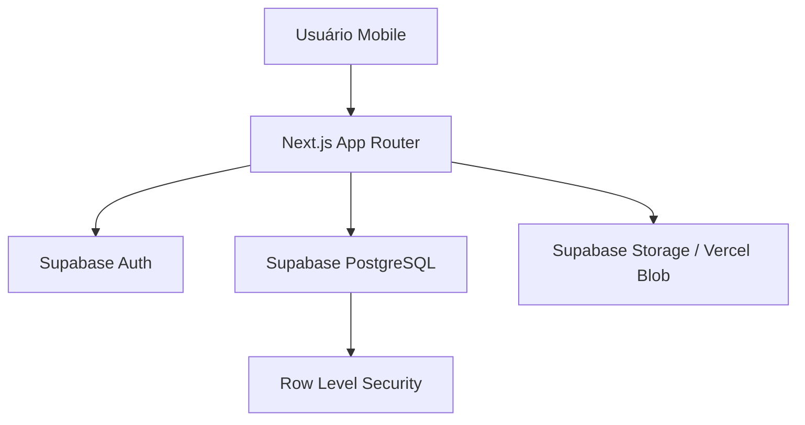

# 🏗️ Arquitetura do Sistema: MobileMakers

Este documento detalha as decisões arquiteturais e a organização técnica do projeto MobileMakers.

## 1. Princípios de Design

- **Mobile-First Indexing:** Todo o layout é construído pensando primeiro na experiência vertical (9:16).
- **Serverless-First:** Lógica de backend distribuída entre Supabase e Vercel Functions.
- **Dynamic Content:** Uso de `force-dynamic` para garantir dados em tempo real sem conflitos de prerender.

## 2. Fluxo de Dados

## 3. Estrutura de Diretórios

| Pasta | Responsabilidade |
| --- | --- |
| `src/app` | Definição de rotas, layouts e as Server Actions. |
| `src/components` | Componentes atômicos e moleculares (shadcn/ui). |
| `src/lib` | Tipagem TypeScript (`data.ts`) e constantes. |
| `src/utils/supabase` | Configuração dos clientes (Server, Client, Middleware). |
| `public` | Assets estáticos (logos, favicons). |

## 4. Estratégia de Renderização

- **Client Components:** Utilizados em formulários, interações de "Like" e componentes com estado local.
- **Server Components:** Utilizados para fetching inicial de dados e páginas de visualização (SEO).
- **Streaming:** Uso de `Suspense` para carregamento progressivo de feeds.

## 5. Segurança (RLS)

A segurança é garantida no nível do banco de dados através das **Policies do Supabase**:
- Usuários podem ler todas as fotos públicas.
- Usuários só podem deletar/editar suas próprias fotos e perfil.
- Somente usuários autenticados podem realizar uploads.

---
*Atualizado em: 2026-05-11*
